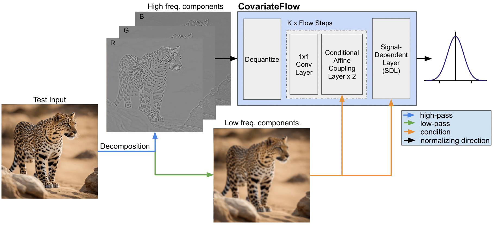

<div align="center">
 <h1> CovariateFlow: Can your generative model detect OOD covariate shift? </h1>
</div>

<div align="center">
    
    <br>
    <p>Detecting out-of-distribution (OOD) sensory data and covariate distribution shifts aims to identify new test examples with different high-level image statistics compared to the normal in-distribution (ID) set. This work demonstrates that CovariateFlow, an unsupervised generative model, can effectively identify samples that deviate significantly from this learned distribution by solely modeling the heteroscedastic high-frequency image component distribution. The proposed method uses conditional Normalizing Flows to detect OOD covariate shifts, showing its effectiveness on CIFAR10 vs. CIFAR10-C and ImageNet200 vs. ImageNet200-C datasets. </p>
</div>

## Example predictions

The image shows example predictions made by CovariateFlow on the ImageNet200(-C) dataset. The model is able to accurately provide higher scores (indicate the object is OOD) of various degridations, irrespective of the semantic class.

<div align="center">
    
</div>

## Some results

<div align="center">
    
    <p>Results obtained with GLOW evaluated with Log-likelihood, Gradient score and NSD on CIFAR10 (test set) vs. CIFAR10-C (test set). Top row: Gaussian Noise 5, Bottom row: Gaussian Blur 5.</p>
</div>

<div align="center">
    
    <p>CovariateFlow consistently outperforms the other models at every severity level</p>
</div>


## Getting started

### Install Requirements

```bash
git clone 
python -m venv covariate_env
.covariate_env/Scripts/Activate.ps1
cd covariateflow
pip install -r requirements
```
### Docker

You can download the docker image [here]() or build it yourself with [dockerfile](dockerfile) in the repo. 


## Datasets

Download the following datasets and add them to the data directory.

| In-Distribution (ID) Datasets | Out-of-Distribution (OOD) Datasets |
|--------------------------|------------------------------|
| Cifar10 (Automatically downloaded)                  |   [Cifar10-C](https://zenodo.org/records/2535967)               |
| [ImageNet-200](https://www.kaggle.com/datasets/nikhilshingadiya/tinyimagenet200)             |   [ImageNet-200-C](https://zenodo.org/records/2536630)              |

## Models

We provide some pretrained weights to test the performance for OOD detection.

* CovariateFlow (Cifar10): [download](checkpoints/CovariateFlow_CIFAR10/CIFAR10_best_bpd.ckpt)
* CovariateFlow (ImageNet-200): [download](checkpoints/CovariateFlow_ImageNet/ImageNet200_best_bpd.ckpt)

## Usage


### Training

To train CovariateFlow on Cifar10, simply run:

```bash
python train.py
```

This script uses 'argparse' to handle command-line arguments, allowing you to configure the training process of the conditional normalizing flow model on various datasets, including MNIST, CIFAR10, and TinyImageNet. 

```bash
python train.py --batch_size 64 --epochs 100
```

### Testing

To test the trained model on all the covaraite conditions, run:

```bash
python test.py --model 'path\to\trained\model' --data_path 'base\path\to\all\data' --output_path 'path\to\store\results' --dataset 'DATSET TO USE'
```

Optionally parameters include:
* '--validation_stats_path' A path to the results you obtained on your validation set so that you do not need to rerun it during each test. Its nice to store this in a json file.
* Subset length, if you wish to do a quick performance test. This runs the model only on a random set of 'subset_length' for both the ID test and OOD test sets.

## Experiment Tracking

The code uses [Weights & Biases](https://wandb.ai/home) to track training runs. 

1. Create an account in [Weights & Biases](https://wandb.ai/home)
2. **If you have installed the requirements you can skip this step**. If not, activate the virtualenv and run:

    ```bash
    pip install wandb
    ```
3. Run the following command and insert you [`API key`](https://wandb.ai/authorize) when prompted:

    ```bash
    wandb login
    ```

## Citation

If you publish work that uses CovariateFlow, please consider citing the following.

**BibTex information will be added later**